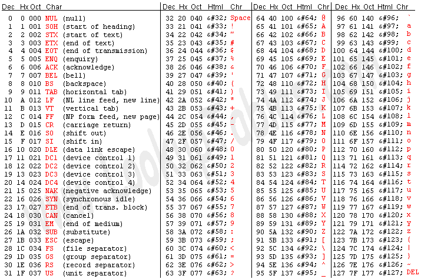

## Table of Contents:
- [What?](#what)
- [What is Brainfuck?](#what-is-brainfuck)
- [How do you write a Discord bot in Brainfuck?](#how-do-you-write-a-discord-bot-in-brainfuck)
- [Directories explained:](#directories-explained)
- [Ok, but why?](#ok-but-why)

---

# What?
> Yes, you read that correctly, I wrote a Discord bot using Brainfuck.

---

# What is Brainfuck?
> Brainfuck is an esoteric programming language, meaning it's not for practical use, like for making software or anything, it's designed as a challenge to make your brain hurt.
>
> Basically, you have an array of integers that are all `0` by default, and you have a pointer that starts at `0`, which is the very start of the array.
>
> You also have the following characters:
> - `>` | Move the pointer forward by 1.
> - `<` | Move the pointer backwards by 1.
> - `.` | Print the ASCII value currently pointed at.
> - `,` | Receive user input and store the given integer at the index pointed at.
> - `+` | Increment integer pointed at by 1.
> - `-` | Decrement integer pointed at by 1.
> - `[` | Start a loop.
> - `]` | Close a loop.
>
> ### NOTE: Any other character will be ignored, so you can add comments really easy, but your comments cannot contain ANY of the above symbols.
>
> Using these characters, you can move through the array and modify numbers. As mentioned above, `.` prints the number your pointing at in ASCII. Here's an ASCII table so you can see what this really does:
>> 
>
> So if we do the following:
> ```
> Use index 1 as the for loop counter which is set to 8
> In the loop we move to index 0 and increment it 9 times
> then we move forward and decrement by 1
> This is basically `for (int i = 8; i != 0; i MinusMinus) { j PlusEquals 9 }`
> When the loop concludes we move back to index 0 and print the value
> >++++++++[<+++++++++>-]<.
> ```
> We'll get the number `72`, which according to the table, is `H`.

---

# How do you write a Discord bot in Brainfuck?
> Trick question; you don't. You can't do anything with Brainfuck except math and print out ASCII characters.
> But if we use [my Brainfuck interpreter](https://github.com/itsamedood/bfi), we can use 3 flags to write code for another language but in Brainfuck:
> - `--out=path/to/out.file` | Writes the output to the specified file.
> - `--dump=bin/file.dump` | Dumps the memory (in this case, the array of integers) to the specified file.
> - `--no_stdout` | When using `.`, the value will not be printed to the console.
>
> The output mentioned above, is comprised of every character printed using `.`, and although we use `--no_stdout`, the output still exists, it just isn't printed to the screen.
>
> So, we can write TypeScript code that makes a Discord bot, but using Brainfuck. The output is the TS code, and the target file is a `.ts` file.

---

# Directories explained:
> - `/bf` The actual Brainfuck code I'm writing.
> - `/templates` Command and event templates (saves a TON of time, so fight me).
> - `/ts` The TypeScript code that my Brainfuck code translates to.

---
>
> If you run this project, you'll see a new folder appear called `dumps`. In here is a dump of the data array from each Brainfuck file. They'll look something like this:
> ```bf
> Brainfuck code to dump from:
> >++++++++[<+++++++++>-]<. H (72)
> >>++++++++++[<++++++++++>-]<+. e (101)
> >>++++++++++[<+++++++++++>-]<--.. ll (108)
> >>++++++++++[<++++++++++>-]<+. o (111)
> >>+++[<+++++++++++>-]<. ! (33)
> ```
> 👇
> Dump of the above Brainfuck code:
> ```ts
> 72, 101, 108, 101, 33, 0
> ```
> Literally just a series of numbers. Pretty simple but helpful for debugging why you're printing the wrong character, because you can see what number you're actually making instead of the one you're targeting.
<!-- >++++++++[<+++++++++>-]<.>>++++++++++[<++++++++++>-]<+.>>++++++++++[<+++++++++++>-]<--..>>++++++++++[<++++++++++>-]<+.>>+++[<+++++++++++>-]<. -->

---

# Ok, but why?
> My [friend](https://www.youtube.com/@FusionTerror) made a joke about writing a Discord bot in Brainfuck, which obviously isn't possible using just Brainfuck. So when I made my own Brainfuck interpreter for fun, I thought back to that joke and decided to make it a reality. Stupid story but I assure you that's what happened.
